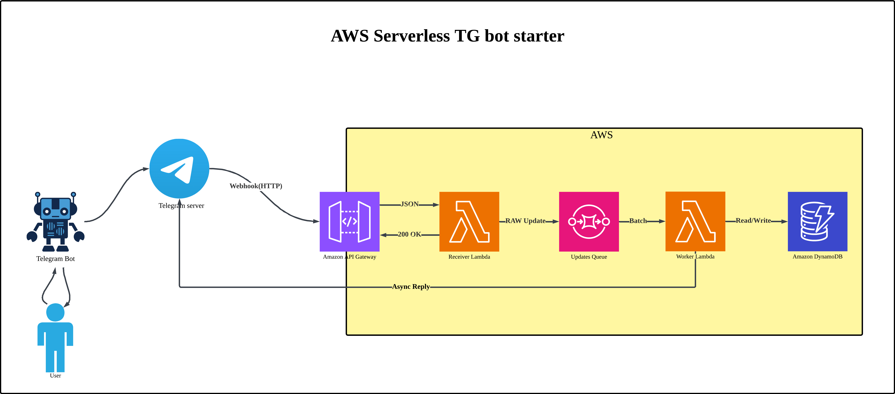

[ 🇬🇧 English ](README.md) | [ 🇰🇿 Қазақша ](docs/README_KK.md) | [ 🇷🇺 Русский ](docs/README_RU.md)


# 🚀 Serverless Telegram Bot Starter

[](https://www.python.org/)
[](https://docs.aws.amazon.com/cdk/)
[](https://github.com/astral-sh/uv)
[](https://github.com/psf/black)


AWS Serverless архитектурасын пайдалана отырып Telegram боттарын орналастыруға арналған дайын шаблон. AWS CDK (Python) негізінде құрылған, дәстүрлі VPS-тен Cloud Native-ге көшіп жатқан әзірлеушілерге арналған.

## Неге Бұл Шаблон?

### Асинхрондық Архитектура: Ойын Ережесін Өзгертуші

15 минуттан кейін үзіліп кететін (timeout) дәстүрлі синхронды Lambda функцияларына қарағанда, бұл шаблон **асинхронды, оқиғаға негізделген (event-driven) архитектураны** қолданады:
```
Telegram → API Gateway → Receiver Lambda → SQS Queue → Worker Lambda → DynamoDB + Telegram API
```

**Негізгі Артықшылықтар:**

- ✅ **Timeout Жоқ**: Worker Lambda хабарламаларды асинхронды өңдейді.
- ✅ **Масштабталатын**: Трафиктің күрт өсуін (мыңдаған қолданушы) автоматты түрде көтереді.
- ✅ **Сенімді**: Dead Letter Queue (DLQ) қате хабарламаларды ұстап қалады.
- ✅ **Үнемді**: Тек қолданғаныңыз үшін төлейсіз (көптеген боттар үшін **ТЕГІН**).

### Бос Тұрған VPS Үшін Төлеуді Доғарыңыз!

Дәстүрлі VPS трафикке қарамастан айына $5-10 тұрады. Serverless арқылы сіз әр сұраныс (request) үшін төлейсіз. Пет-жобалар мен стартаптардың көбі үшін **AWS шотыңыз $0.00 болады** (Free Tier арқасында).

## Архитектура



## Құнын Бағалау (Cost Estimation)

### Бұл қымбат па? Жоқ. Сірә, ТЕГІН.

| Ресурс | Free Tier Лимиті (Айына) | Боттың Шамамен Алғандағы Сыйымдылығы |
|--------|--------------------------|---------------------------------------|
| AWS Lambda | 400,000 ГБ-секунд | ~3,000,000 хабарлама |
| API Gateway | 300 млн сұраныс (1-ші жыл) | Боттар үшін шектеусіз |
| DynamoDB | 25 ГБ Сақтау орны | Миллиондаған жазбалар |
| SQS | 1 Миллион Сұраныс | ~500,000 хабарлама |

**Қорытынды:** Көптеген стартаптар үшін AWS шотыңыз **$0.00** болады.

## 🛠️ Супер Жылдам Бастау

### Алғышарттар (Prerequisites)

- **[AWS CLI](https://aws.amazon.com/cli/)** орнатылған және бапталған.
- **[Docker](https://www.docker.com/)** қосылған (CDK жинау үшін қажет).
- **[uv](https://github.com/astral-sh/uv)** орнатылған (Python пакет менеджері).

### 1. Жобаны Инициализациялау

```bash
# Репозиторийді клондау
git clone [https://github.com/Bayashat/serverless-tg-bot-starter.git](https://github.com/Bayashat/serverless-tg-bot-starter.git)
cd serverless-tg-bot-starter

# Тәуелділіктерді (dependencies) орнату
uv sync
```

### 2. Ортаны Баптау (.env)
```bash
# .env файлын жасау және токендерді генерациялау
echo "TELEGRAM_BOT_TOKEN=сіздің_токен" > .env
echo "TELEGRAM_WEBHOOK_SECRET_TOKEN=$(openssl rand -hex 32)" >> .env
```

### 3. Орналастыру (Local Dev)
```bash
# Инфрақұрылым папкасына өту
cd infra

# CDK дайындау (аккаунтқа бір рет қана қажет)
uv run cdk bootstrap

# Dev ортасына орналастыру (Deploy)
uv run cdk deploy -c env=dev
```

### 4. Webhook баптау (шығарудан API URL пайдаланыңыз)

Терминалдан WebhookApiUrl көшіріп алыңыз және оны тіркеңіз:

```bash
# YOUR_API_URL орнына шыққан сілтемені қойыңыз
curl -X POST "[https://api.telegram.org/bot](https://api.telegram.org/bot)<YOUR_BOT_TOKEN>/setWebhook" \
  -H "Content-Type: application/json" \
  -d '{"url": "YOUR_API_URL/webhook", "secret_token": "YOUR_SECRET_TOKEN"}'
```

Дайын! Ботыңыз жұмыс істейді. 🎉


## 👨‍💻 Кәсіби Жұмыс Процесі

Бұл жай ғана шаблон емес, бұл толыққанды инженерлік орта.

### Код Сапасы (Pre-commit)

Біз код стилінің біркелкі болуы үшін pre-commit (Black, Flake8) қолданамыз.

```bash
# Git hook-тарды орнату
uv run pre-commit install

# (Қосымша) Қолмен іске қосу
uv run pre-commit run --all-files
```

### CI/CD Пайплайн (GitHub Actions)

Жобада автоматтандырылған пайплайн (.github/workflows/deploy.yml) бар. Ол push жасағанда dev ортасына, ал қолмен қосқанда prod ортасына деплой жасайды.

### Қауіпсіздік: Access Key Қажет Емес!

Біз құпия сөзсіз қауіпсіз деплой үшін AWS OIDC (OpenID Connect) қолданамыз.

Баптау скриптін іске қосыңыз:

```bash
# Скрипті қосуға қажетті рұқсатын беру
chmod +x scripts/setup_oidc.sh

# Қолданылуы: ./scripts/setup_oidc.sh <github_user>/<repo_name>
./scripts/setup_oidc.sh yourname/serverless-tg-bot-starter
```

**GitHub-қа құпия кілттерді қосу:** Скрипт шығарған `AWS_ROLE_ARN` мәнін көшіріп, Бот токендарымен бірге репозиторийдің Secrets бөліміне қосыңыз.


## 📚 Құжаттама

- 📖 **[Әзірлеуші Нұсқаулығы](docs/developer_guide.md)**: : Handler жазу, Context объектісін қолдану.
- 🚀 **[Орналастыру Нұсқаулығы](docs/deployment.md)**: CI/CD баптау, OIDC және мониторинг.

## 🤝 Жобаға Үлес Қосу (Contributing)

Үлес қосуға қуаныштымыз! Pull Request жібермес бұрын pre-commit іске қосуды ұмытпаңыз.

## Лицензия

MIT License — бұл шаблонды өз жобаларыңызда еркін қолданыңыз!

---

**Орталық Азиядағы Serverless-ке өтіп жатқан әзірлеушілер үшін ❤️-пен жасалған**
