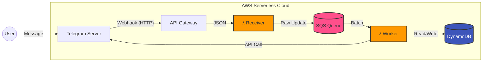

[ 🇬🇧 English ](../README.md) | [ 🇷🇺 Русский ](README_RU.md) | [ 🇰🇿 Қазақша ](README_KK.md)

# 🚀 Serverless Telegram Bot Starter


Готовый к продакшену шаблон для размещения Telegram ботов на AWS с использованием Serverless архитектуры. Построен на AWS CDK (Python), разработан для разработчиков, переходящих с традиционных VPS на Cloud Native.

## Почему Этот Шаблон?

### Асинхронная Архитектура: Игра Меняется

В отличие от традиционных синхронных Lambda-функций, которые завершаются по таймауту через 15 минут, этот шаблон использует **асинхронную, событийно-ориентированную архитектуру**:

```
Telegram → API Gateway → Receiver Lambda → SQS Queue → Worker Lambda → DynamoDB + Telegram API
```

**Ключевые Преимущества:**

- ✅ **Без Таймаутов**: Worker Lambda обрабатывает сообщения асинхронно, без ограничения в 15 минут
- ✅ **Масштабируемость**: Автоматически обрабатывает всплески трафика без ручного масштабирования
- ✅ **Отказоустойчивость**: Dead Letter Queue (DLQ) захватывает неудачные сообщения для отладки
- ✅ **Нулевое Обслуживание**: Нет серверов для управления, не нужен SSH доступ
- ✅ **Экономичность**: Платите только за то, что используете (скорее всего БЕСПЛАТНО для большинства ботов)

### Хватит Платить за VPS, Который Простаивает!

Традиционный VPS стоит $5-10/месяц независимо от трафика. С Serverless вы платите за запрос. Для большинства хобби-ботов и стартапов **ваш счет AWS будет $0.00** благодаря щедрому Free Tier.

## Архитектура



## Оценка Стоимости

### Дорого ли это? Нет. Скорее всего БЕСПЛАТНО.

В отличие от традиционного VPS, который стоит $5-10/месяц независимо от трафика, Serverless работает по принципу "Плати за использование".

| Ресурс | Лимит Free Tier (Ежемесячно) | Примерная Емкость Бота |
|--------|------------------------------|------------------------|
| AWS Lambda | 400,000 GB-секунд | ~3,000,000 сообщений |
| API Gateway | 300 миллионов запросов (Первый год) | Безлимитно для ботов |
| DynamoDB | 25 GB Хранилища | Миллионы записей пользователей |
| SQS | 1 Миллион Запросов | ~500,000 сообщений |

**Вердикт:** Для большинства стартапов и хобби-ботов ваш счет AWS будет **$0.00**.

## Супер Быстрый Старт

```bash
# 1. Клонировать и настроить
git clone https://github.com/yourusername/serverless-tg-bot-starter.git
cd serverless-tg-bot-starter
uv sync

# 2. Настроить .env файл
echo "TELEGRAM_BOT_TOKEN=ваш_токен" > .env
echo "TELEGRAM_WEBHOOK_SECRET_TOKEN=$(openssl rand -hex 32)" >> .env

# 3. Развернуть
cdk bootstrap
cdk deploy -c env=dev

# 4. Настроить webhook (используйте API URL из вывода)
curl -X POST "https://api.telegram.org/bot<TOKEN>/setWebhook" \
  -H "Content-Type: application/json" \
  -d '{"url": "YOUR_API_URL/webhook", "secret_token": "YOUR_SECRET_TOKEN"}'
```

Всё! Ваш бот работает. 🎉

📖 **Прочитайте полное [Руководство Разработчика](developer_guide.md), чтобы узнать, как писать обработчики.**

🚀 **Проверьте [Руководство по Развертыванию](deployment.md) для CI/CD и устранения неполадок.**

## Вклад в Проект

Вклад приветствуется! Пожалуйста, не стесняйтесь отправить Pull Request.

## Лицензия

MIT License - не стесняйтесь использовать этот шаблон для ваших проектов!

## Поддержка

- 📖 [Документация](https://github.com/yourusername/serverless-tg-bot-starter/wiki)
- 💬 [Обсуждения](https://github.com/yourusername/serverless-tg-bot-starter/discussions)
- 🐛 [Трекер Проблем](https://github.com/yourusername/serverless-tg-bot-starter/issues)

---

**Сделано с ❤️ для разработчиков в Центральной Азии, переходящих на Serverless**
